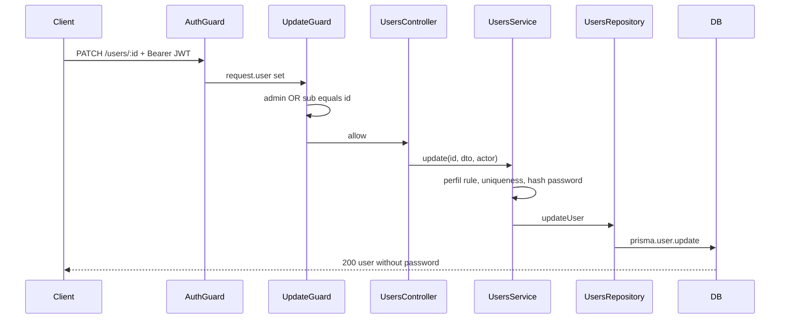

# User Profile Update Design

**Spec**: `.specs/features/user-profile-update/spec.md`
**Context**: `.specs/features/user-profile-update/context.md`
**Status**: Approved

---

## Architecture Overview

Replace the stub `PATCH /users/:id` with a vertical slice: controller (UUID string + ValidationPipe body) → `UsersService.update` (authz, uniqueness, password hash, omit password) → existing `UsersRepository.updateUser`. Authorization uses a request-aware update guard plus CASL admin capability. JWT `sub` becomes the user UUID so self-update can compare `:id` to the token.



---

## Code Reuse Analysis

### Existing Components to Leverage

| Component | Location | How to Use |
| --------- | -------- | ---------- |
| UsersRepository.updateUser | `src/service/user.service.ts` | Wire from UsersService; add omit password on return |
| UsersRepository.getUser | same | Email uniqueness check excluding self |
| bcrypt hash pattern | `src/users/users.service.ts` create | Reuse saltRounds = 10 when password present |
| UpdateUserDto | `src/users/dto/update-user.dto.ts` | Keep PartialType(UserDto); ValidationPipe already global |
| PoliciesGuard / CheckPolicies | `src/casl/` | Pattern reference; update uses dedicated guard for ownership |
| ConflictException message | `src/pipes/unique-email.pipe.ts` | Same Portuguese message on duplicate email |

### Integration Points

| System | Integration Method |
| ------ | ------------------ |
| JWT AuthGuard | Global; `request.user` must expose `sub` as user id |
| Prisma User | Update by `{ id }`; unique on email |
| CASL | Admin retains unrestricted Update; normal ownership enforced in UpdateUserGuard |

---

## Components

### AuthService JWT payload (change)

- **Purpose**: Put stable user id in `sub` so PATCH ownership checks work
- **Location**: `src/auth/auth.service.ts`
- **Interfaces**:
  - `signIn(email, password): { access_token }` — payload `{ sub: user.id, username, perfil, email }`
- **Dependencies**: UsersRepository, JwtService
- **Reuses**: Existing signIn flow; only payload shape changes

### UpdateUserGuard

- **Purpose**: Allow PATCH when actor is admin OR `request.user.sub === params.id`
- **Location**: `src/users/update-user.guard.ts` (or under `src/casl/`)
- **Interfaces**:
  - `canActivate(context): Promise<boolean>` — throws ForbiddenException on deny
- **Dependencies**: CaslAbilityFactory (admin Update check) or direct `perfil === admin`
- **Reuses**: AuthenticatedUser type from casl-ability.factory

### UsersService.update

- **Purpose**: Apply business rules and persist update
- **Location**: `src/users/users.service.ts`
- **Interfaces**:
  - `update(id: string, dto: UpdateUserDto, actor: AuthenticatedUser): Promise<Omit<User, 'password'>>`
- **Dependencies**: UsersRepository
- **Reuses**: create() password hashing; findOne NotFoundException style
- **Rules**:
  - IF user missing → 404
  - IF normal actor and `dto.perfil` defined → 403
  - IF `dto.email` set and another user owns it → 409
  - IF body has no keys after stripping undefined → 400
  - IF password set → hash; else omit from prisma data
  - Return user with password omitted

### UsersRepository.updateUser

- **Purpose**: Persist and return safe projection
- **Location**: `src/service/user.service.ts`
- **Change**: `omit: { password: true }` on update result (mirror getUser)

### UsersController.update

- **Purpose**: HTTP adapter
- **Location**: `src/users/users.controller.ts`
- **Change**: Pass `id` as string (no `+id`); `@UseGuards(UpdateUserGuard)`; pass `request.user` into service; optional ParseUUIDPipe for 400 on bad UUID

### UpdateUserPolicyHandler (optional thin)

- Not required if UpdateUserGuard covers admin + ownership. Prefer one guard to avoid double policy layers.

---

## Data Models (if applicable)

### Update payload (existing)

```typescript
// UpdateUserDto = PartialType(UserDto)
{
  name?: string
  email?: string
  perfil?: Perfil
  password?: string
  neighborhood?: string
  street?: string
}
```

### JWT payload (new)

```typescript
{
  sub: string      // user.id UUID
  username: string
  perfil: Perfil
  email: string    // convenience for logs; not used for ownership
}
```

**Relationships**: `sub` must equal `User.id` for self-update checks.

---

## Error Handling Strategy

| Error Scenario | Handling | User Impact |
| -------------- | -------- | ----------- |
| No / invalid JWT | AuthGuard UnauthorizedException | 401 |
| Normal updates another user | UpdateUserGuard ForbiddenException | 403 |
| Normal sends perfil | UsersService ForbiddenException | 403 |
| Unknown id | NotFoundException | 404 |
| Duplicate email | ConflictException | 409 |
| Empty body / invalid fields / bad UUID | BadRequestException / ValidationPipe / ParseUUIDPipe | 400 |

---

## Risks & Concerns

| Concern | Location (file:line) | Impact | Mitigation |
| ------- | -------------------- | ------ | ---------- |
| JWT `sub` is email today | `src/auth/auth.service.ts:23` | Self-update by UUID impossible | Change `sub` to `user.id` (AD-003); tokens issued before change become ownership-mismatched until re-login |
| Stale scaffold e2e | `test/app.e2e-spec.ts` | Full gate fails | Replace with users PATCH e2e in this feature |
| No unit tests / jest fails empty | jest config | Quick gate fails | First task ships `*.spec.ts` |
| Password validators missing on UserDto | `create-user.dto.ts` | Weak password on update | Out of scope; hash if present only |
| Throttler 5/60s | `app.module.ts` | e2e may throttle | Space requests or raise limit in e2e module override if needed |

---

## Tech Decisions (only non-obvious ones)

| Decision | Choice | Rationale |
| -------- | ------ | --------- |
| JWT `sub` claim | User UUID (`user.id`) | Ownership compare on `:id` requires id in token; email in `sub` blocks RF03 |
| Authz mechanism | Dedicated `UpdateUserGuard` (admin OR self) | Existing PoliciesHandler API has no request/params; avoids rewriting all policies |
| Perfil restriction | Enforced in UsersService after guard | Guard answers "who may touch this row"; service answers "which fields" |
| Email uniqueness | Service check excluding current id | UniqueEmailPipe is create-oriented (no id to exclude) |
| Stale e2e | Delete Hello World test; add PATCH users e2e | Required for Full/Build gates |

> **Project-level decisions:** JWT `sub` = user id is recorded as AD-003 in `.specs/STATE.md`.
